# vue-manage-system

基于vue2+ Element UI开发的后台管理系统。项目功能较为完善，实现逻辑简单。

## 技术栈

- UI：Element-ui
- Vue全家桶：vue2、vue-router、vuex、axios
- 后台接口：nodejs、express、mysql，编写Restful风格接口
- 打包上线：使用webpack优化项目打包，申请、配置阿里云服务器，将项目打包上线。（服务器申请不到3个月不能进行ICP备案，所以还不能访问）

## 功能 

-  登录/登出
-  注册
-  首页与个人中心
-  tags
-  面包屑
    - 显示当前用户所在的路径
-  表单功能
      - 支持增删改查
      - 支持分页显示、设置页码大小
      - 支持搜索查询
-  文件管理
    - 文件上传、多文件上传
    - 大文件上传，支持断点续传和进度条功能
    - excel上传和下载，支持拖拽上传
-  富文本/markdown编辑器
-  权限管理和动态路由
   - 分为管理员和普通员工两个权限
     - 不同权限可访问的url不同
     - 不同权限会显示不同的内容

## 项目运行

数据都是从后端获得得到，因此该项目的运行需要和[后端项目](https://github.com/ppGo8/vue-management-system-api)相互配合。

:sunflower: 最近会写`mock`拦截ajax请求，生成数据，使得项目可以单独运行。

## 项目截图

### 登录&&注册

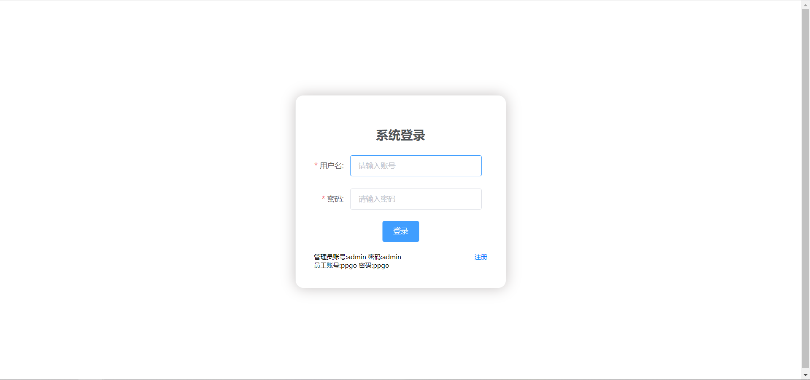

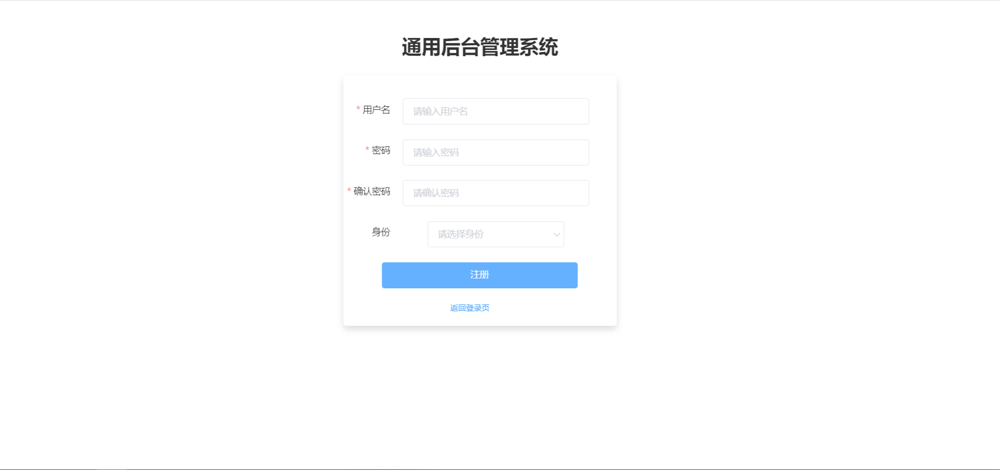

### 首页

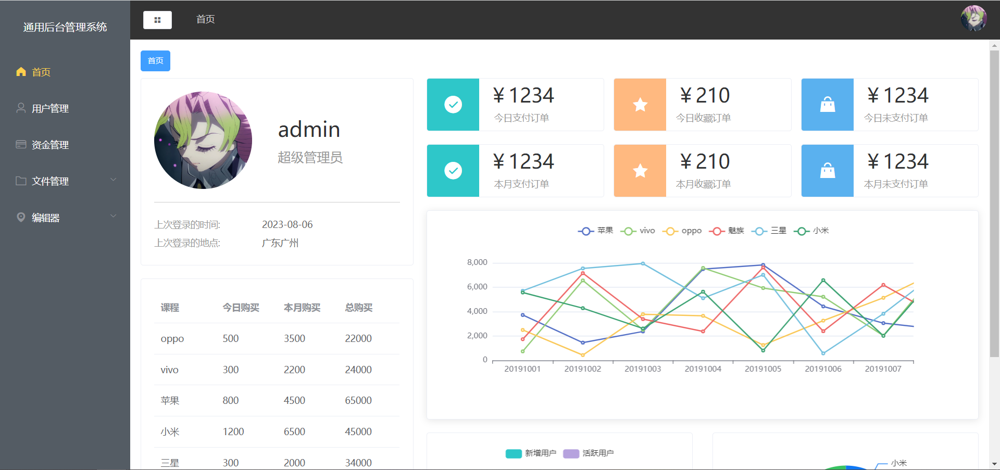

### 用户管理

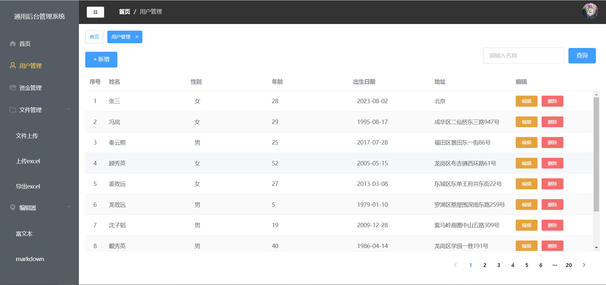

### 资金管理

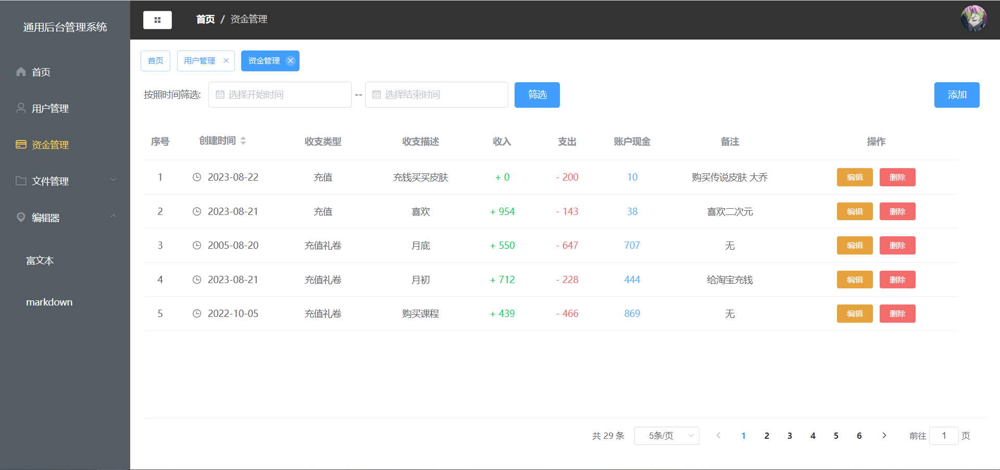

### 文件管理

#### 文件上传

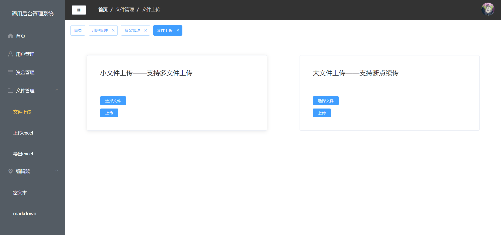

#### 上传excel

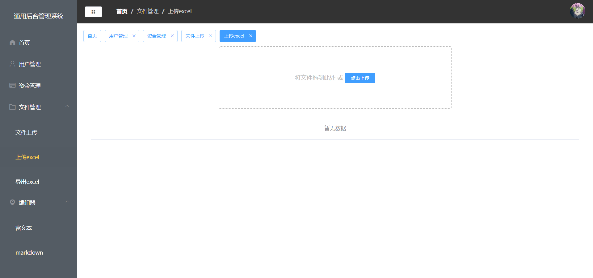

#### 导出excel

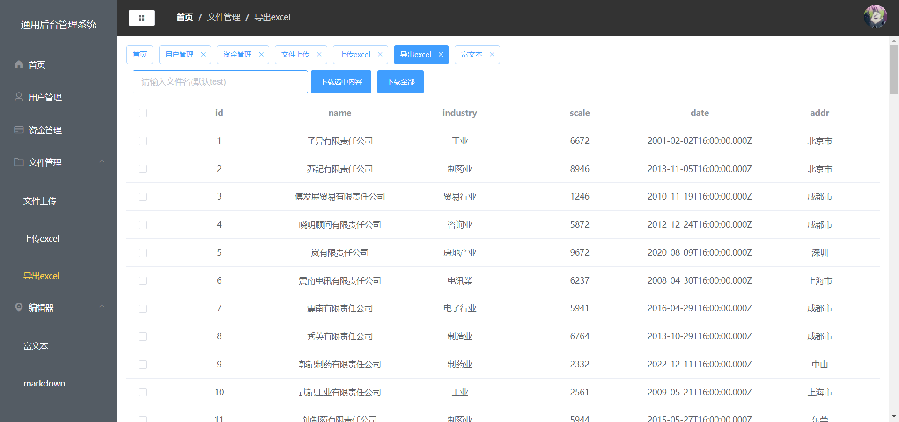

### 上传excel

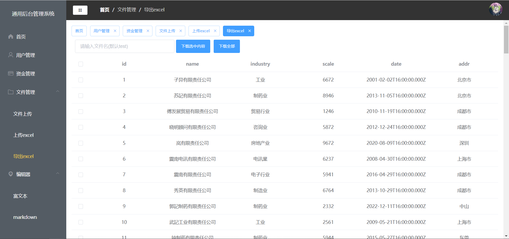

### 编辑器

#### 富文本编辑器

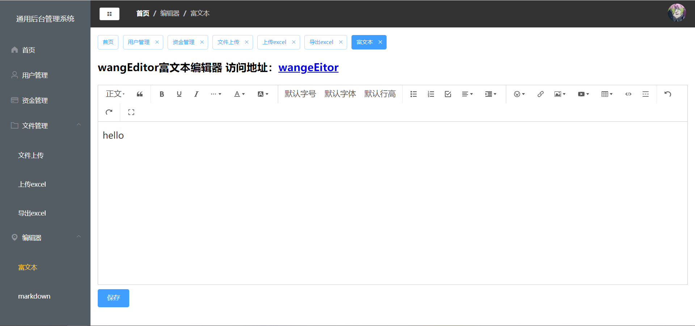

#### markdown编辑器

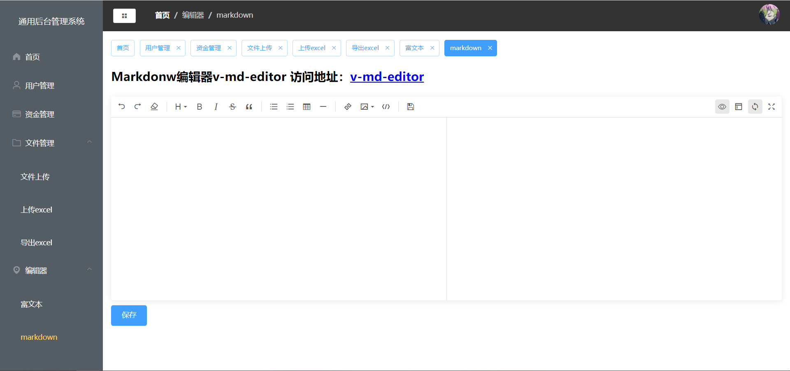
