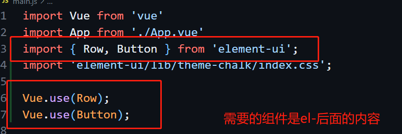
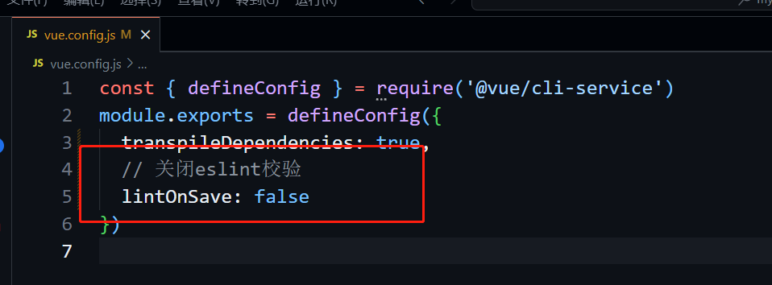

# 开发前准备

## 包管理工具

- npm

  - npm安装包的版本可能**无法保持一致性**

  ```shell
  "5.0.3"  # 安装指定版本
  "~5.0.3" # 安装5.0.x的最新版本
  "^5.0.3" # 安装5.x.x的最新版本
  ```

- Yarn

  - 速度快：下载所有包的时候并行安装，同步执行所有任务

  - 离线模式：有缓存，

  - 安装**版本统一**：yarn.lock文件

  - 更简洁的输出：npm输出信息荣昌，yarn只打印必要信息

  - **多注册来源处理**：<font color=red>所有依赖的包，不管他被不同的库间接关联多少次，安装这个包时，只会从一个注册来源去装，要么从npm安装要么从bower安装。</font>

  - 更好的语义化

## 脚手架

使用vue-cli创建项目结构

- 第一步,安装脚手架

```shell
node -v # 检查node是否安装
npm -v # 检查npm是否安装
# 安装脚手架
npm install -g @vue/cli
# or
yarn global add @vue/cli
```

```shell
# 安装yarn,如果没有yarn
npm i -g yarn
```

如果下载速度慢，可以设置镜像为国内镜像

```shell
# 查看npm镜像地址
npm config get registry  
# 设置为国内镜像
npm config set registry  https://registry.npmmirror.com/
```

- 第二步，使用cli创建项目

  注意项目名称不能使用小驼峰命名，需要使用中划线

  ```shell
  vue create my-app # 之后需要选择创建Vue2还是Vue3的项目
  ```

  

  本项目首先新创建Vue2，然后使用Vue3重构

- 启动项目

  ```shell
  npm run serve
  ```

## element-ui

> https://element.eleme.cn/#/zh-CN/component/installation

- 安装element-ui

  ```shell
  npm i element-ui -S  # -S安装到node_module中
  ```

  说明：`package.json`中的内容

  `dependencies`：项目依赖，在开发环境和生产环境都需要的以来

  `devDependencies`：开发环境需要的依赖，上线后不需要使用这里的内容

- 使用方法

  - 方法1 全局引入：

    在`main.js`中引入并使用

    ```js
    import ElementUI from 'element-ui';
    import 'element-ui/lib/theme-chalk/index.css';
    
    Vue.use(ElementUI);
    ```

  - 方法2 按需引入：

    - 安装插件

      ```shell 
      npm install babel-plugin-component -D
      ```

    - 修改`.babelrc`或相同作用的文件`babel.config.js`

      

    - 解构语法引入需要组件

      

    - 启动`npm run serve`

      问题：报错提示没有`es2015`，解决方法：修改babel.config.js文件为下图中的内容

      重新运行

    - 项目打包

      ```shell 
      npm run bulid  # 打包后多了一个dist文件夹
      ```

      项目上线时就是把`dist`文件部署到服务器中

## 引入Vue-router

>https://v3.router.vuejs.org/zh/installation.html

- 安装`vue-router`

  - 注意版本

    `vue2`对应的`vue-router`为`3.x`的版本

    `vue3`对应的`vue-router`为`4.x`的版本

    ```sh
    npm i vue-router@3.6.5
    ```

- 引入`Vue-router`

  新建目录结构`src/router/index.js`，添加如下内容

  ```js
  import Vue from 'vue'
  import VueRouter from 'vue-router'
  
  Vue.use(VueRouter)
  ```

- :rainbow: 使用`Vue-router`（**重要**）

  注意，这里只配置了简单路由，后面需要使用嵌套路由实现页面所需的功能。

  1. 配置`src/router/index.js`文件内容

     ```js
     import Vue from 'vue'
     import VueRouter from 'vue-router'
     
     Vue.use(VueRouter)
     
     // 1.创建路由组件:通过import方法引入
     import Home from '../views/Home.vue'
     import User from '../views/User.vue'
     
     // 2.创建路由:将路由与组件一一映射
     const routes = [
         { path: '/home', component: Home },
         { path: '/user', component: User },
     ]
     
     // 3.创建router实例,传入routes配置
     const router = new VueRouter({
         routes // 缩写,等价于routes:routes
     })
     
     // 4.暴露路由器
     export default router
     ```

  2. 配置`main.js`，将`router`挂载到`vm`上

     ```js
     import router from './router' // 引入路由器router
     
     new Vue({
       render: h => h(App),
       router // 将router挂载到vm上
     }).$mount('#app')
     
     ```

  3. 修改`App.vue`，在`tempalte`中设置路由出口

     ```js
     <template>
       <div id="app">
         <!-- 路由出口 -->
         <!-- 路由匹配的组件将会渲染在这里 -->
         <router-view></router-view>
       </div>
     </template>
     ```

- 其他补充：关闭`eslint`校验

  


