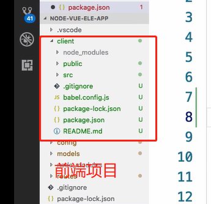

# 前后端连载

## 启动方式

1. 前后端分开启动：前后端在不同的目录下，使用两个终端 、使用两个端口

2. 前后端连载：前后端在不同的目录下，使用一个终端、一条命令，同时启动两个端口

   ```sh
   # 将多个终端启动的项目绑定在一起
   npm i concurrently 
   ```

   将前端项目和后端项目放在一个目录下，以及其他一系列操作。

   

   修改前后端的`package.json`文件


## 配置代理

在`vue.config.js`中进行跨域请求配置

后端域名为：`ttp://localhost:5000`

```js
// 设置axios跨域代理
devServer: {
proxy: {
  '/api': {
    // 目标服务器域名
    target: "http://localhost:5000",
    ws: true,
    changOrigin: true,
  }
}
}
```

## 请求拦截和响应拦截


## 路由守卫和token过期处理 


