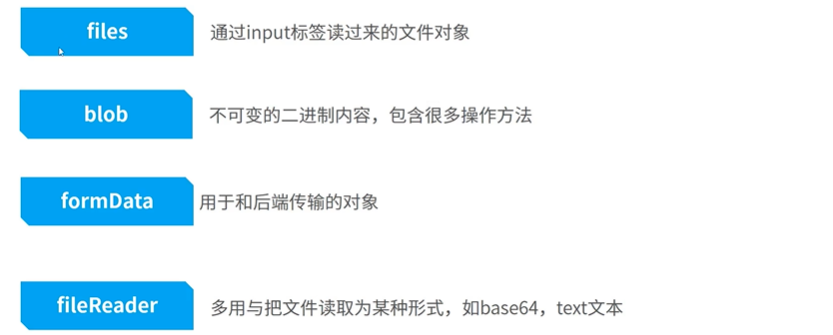
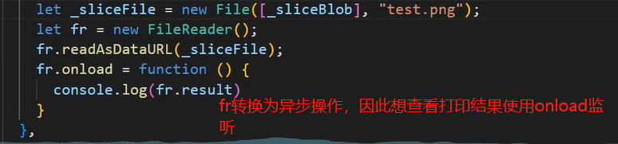
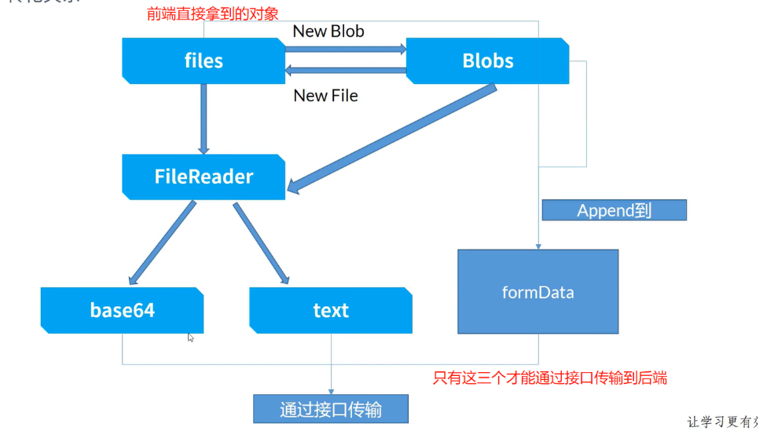
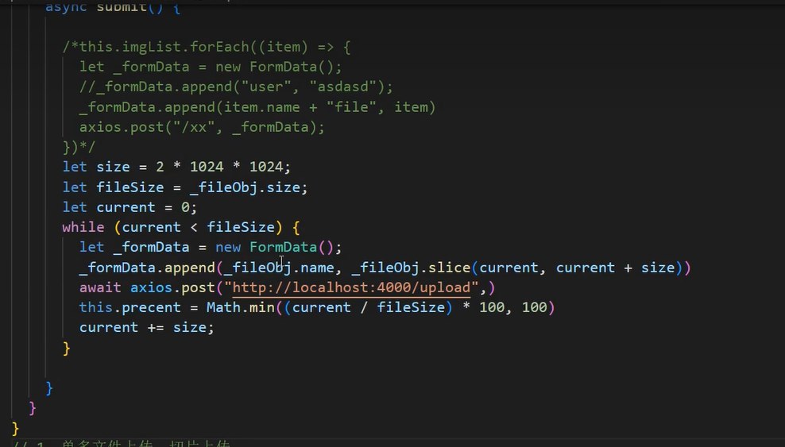

# 文件管理功能


## 理论

### 基础知识

> **视频地址**
>
> https://www.bilibili.com/video/BV1424y1g7ma/?spm_id_from=333.788.recommend_more_video.18&vd_source=dde2f4dd432156027fedf9b1734ba705

- 前端文件传送到后端的两种方式：

  - 二进制的`blob`对象上传，并搭载在`formData`中

  - 文件转成`base64`上传到`base64`,后端再把`base64`解析回文件

- 相关对象

  

  - `files`是`blob`的子类，二者可以互相转换

    `files`是前端的对象，后端不认识，不能直接传递给后端

  - `fromData`理解为汽车，搭载`blob`

  - `fileReader` 将文件读成某种形式，如`base64`或`text`，传输

### 核心代码

####  file/blob

- 切割文件

  ```js
  // 用户从input标签上传得到的file
  const file = e.target.files[0]
  // 使用slice方法切割
  const _sliceBlob = new Blob([file]).slice(0,5000)
  const _sliceFile = new File([_sliceBlob],'文件名').slice(0,5000) // blob和slice可以相互转换
  ```

#### fileReader

- 核心代码

  ```js
  let fr = new FileReader()
  fr.readAsDataUrl(file) // file转换成base64
  fr.readAsText(file)    // file转换成text
  ```

  

- `fileReader`应用

  - 做缩略图预览

    `fileReader`读取截取了一部分的缩略图，然后使用img标签展示

  - 做文本预览

    上传了一个文本文件，使用`fileReader`的`readAsText`设置展示到`div`中

#### fromData

```js
async submit(){
	const _formData = new FormData();
    // 搭建上传的文件,也可搭建其他信息
    _fromData.append('user','pp') // pp上传
    _formData.append('xxx',file)  // 用户通过input标签上传得到的文件对象
    // 上传文件给后端
    axios.post('/xxx',_formData)
    
}
```

### 转换关系




## 核心代码

### 单文件上传

### 多文件上传

- 业务理解

  有两种多文件上传方式。

  - 直接在`input`标签中写`multiple`；用户点击上传文件后，在弹出的文件窗口`ctrl`选中多个文件。很多用户可能不知道按住`ctrl`多文件上传。

  - 每次点击上传一个，一共点击多次上传。（需要手动写逻辑实现）

> **注意**
>
> 可以上述两种方式结合使用，在`input`标签中写`multiple`，然后判断逻辑。

- 核心代码

  下面逻辑代码实现了上述的两种方式

  

### 大文件切片上传

- 业务需求

  - 当一个文件很大时,往往使用切片上传；

  - 切片上传往往会在页面中搭配一个进度显示条。

- 核心代码

  

  上传进度还可以再优化

### 断点续传

- 业务需求：

  主要是后端记录传输到了哪里

## 参考视频

> 原理一个视频
>
> https://www.bilibili.com/video/BV1424y1g7ma/?spm_id_from=333.788.recommend_more_video.18&vd_source=dde2f4dd432156027fedf9b1734ba705


> 实现文件上传和下载
>
> https://www.bilibili.com/video/BV1Sm4y1R7m6/?spm_id_from=333.999.0.0&vd_source=dde2f4dd432156027fedf9b1734ba705


> 实现大文件上传和断点续传
>
> https://www.bilibili.com/video/BV1WP4y1s7LR/?spm_id_from=333.337.search-card.all.click&vd_source=dde2f4dd432156027fedf9b1734ba705


> 文件拖拽显示进度
>
> https://www.bilibili.com/video/BV1mW4y1y7vE/?spm_id_from=333.337.search-card.all.click&vd_source=dde2f4dd432156027fedf9b1734ba705


