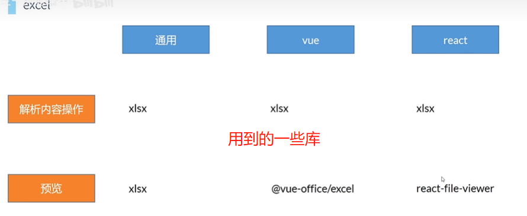
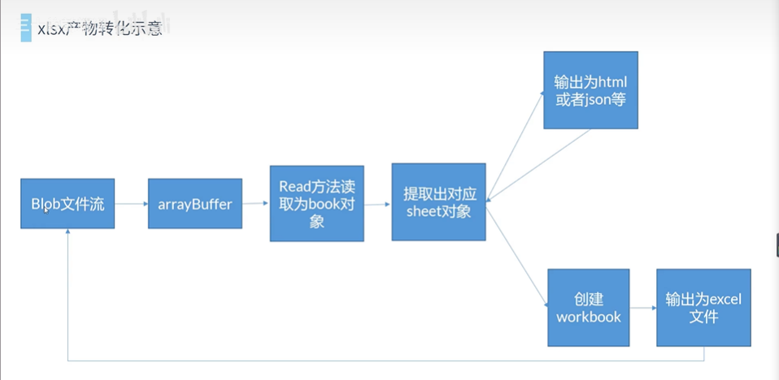
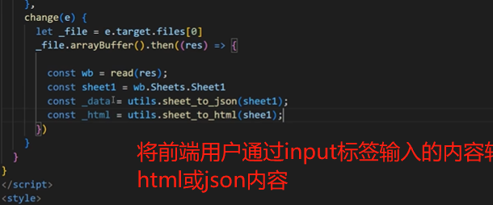
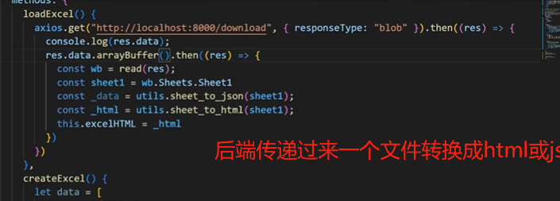
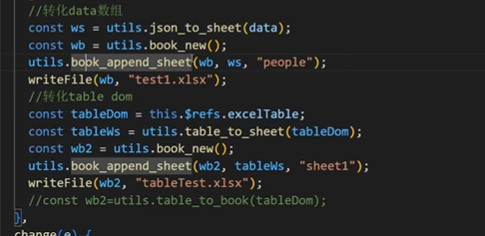
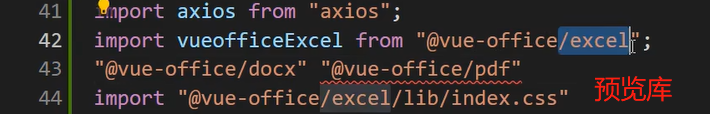
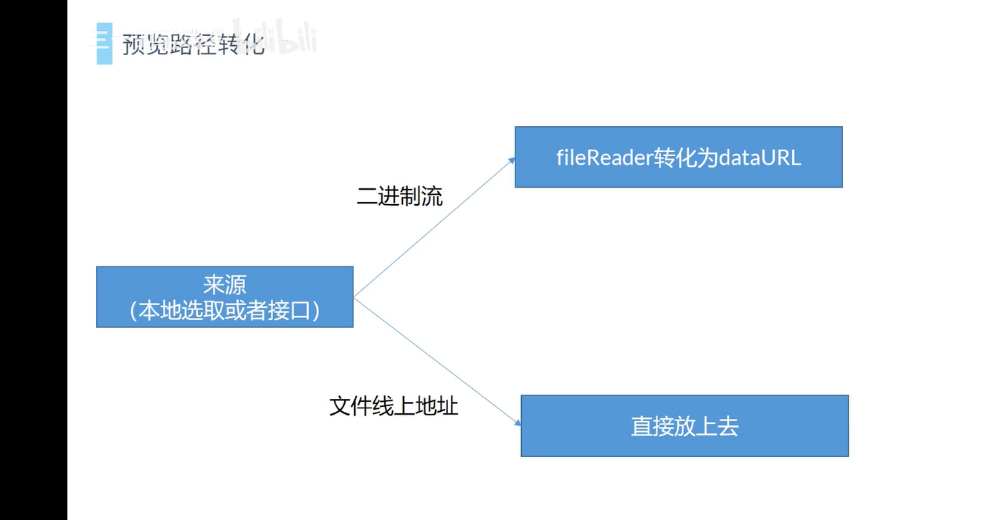
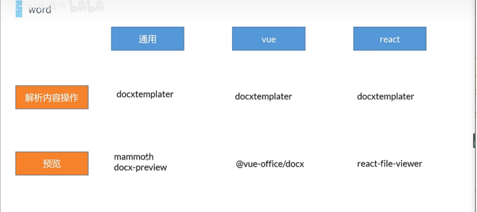

# 前端excel和world操作

## 基础

> 参考视频
>
> https://www.bilibili.com/video/BV1ko4y1B7z2/?spm_id_from=333.999.0.0&vd_source=dde2f4dd432156027fedf9b1734ba705

## 解析内容操作

将读取的excel转换成Html和Json

使用xlsx库解析内容操作

对excel的操作有两类：预览和解析内容

blob:前端用户通过Input标签输入或者从后端得到的

arrayBuffer:所有的blob对象会自带一个方法，转换成这个对象

book:整个excel文件

sheet:excel中单个工作簿

##  转换成excel表格

### 前端table dom转换成excel

### 前端对象转换成excel

## 预览

因为xlsx库的只是得到一个json和

可以使用vue/office库预览；

### 本地选择

 读取为前端的html和数据对象

book的重要属性：sheets和sheetName

### 后端请求转换

## world

world做的比较多的是预览。

