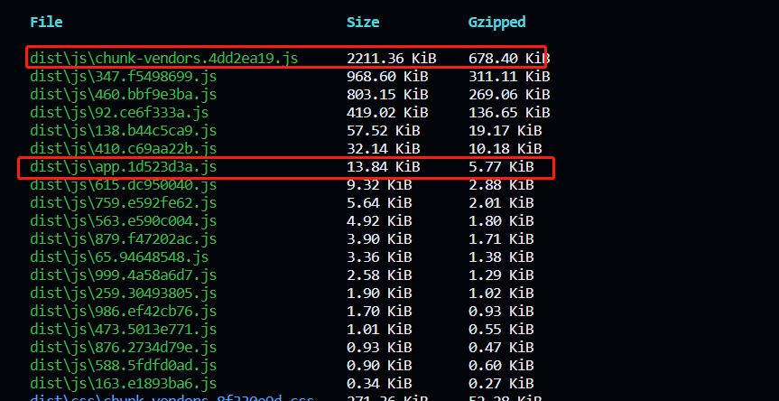

# 配置webpack

## 目标

- 目标：手动配置webpack以提高**生产环境**打包速度、减小打包体积

  - 未手动配置webpack，使用`npm run build`**打包生产环境的代码**,打包结果如下

    耗时：约80s

    chunk-vendors文件大小有4M。没有使用动态加载，因此这些组件在使用的时候会在刚访问网站的时候一起加载，弱网的情况下只能显示一个大白板。

    

  - 通过` Chrome `的` Instrument converge `功能查看` js`，`css` 的资源未使用率

    方法：打开 Chrome 的调试模式，CRTL+SHIFT+P 调出命令面板，输入 Coverage，选择 Show Coverage，，点击按钮 Instrument converge 就能查看已加载资源的未使用率。

    

    `chunk-vendors.82702712.js`未使用率约60%

    `app.js`未使用率约70%

    `app.css`未使用率约80%

    `chunk-vendors.ea3fa8e3.css`未使用率90%

- **基于上述问题，优化打包可以从以下几方面入手**

  路由组件动态引入，按需要加载。将`app.js`拆分为若干`js`使用时采取加载

  使用第三方库，按需加载，将`chunk-vendors.js`拆分，等到需要时再去加载

  压缩资源文件，减小大小

## 优化项目打包

### 路由懒加载

修改路由组件的引入方式。

旧的路由组件的引入方式

```js
import Main from '../views/Main.vue'
import Home from '../views/Home.vue'
import User from '../views/User.vue'
import Mall from '../views/Mall.vue'
import PageOne from '../views/PageOne.vue'
import PageTwo from '../views/PageTwo.vue'
import Login from '../views/Login.vue'
import Register from '../views/Register.vue'
import NotFound from '../views/404.vue'
import InfoShow from '../views/InfoShow.vue'
import FundList from '../views/FundList.vue'
import UploadFile from '../views/UploadFile.vue'
import ExcelUpload from '../views/ExcelUpload.vue'
import ExcelExport from '../views/ExcelExport.vue'
```

这样会导致这些组件都打包到`app.js`文件中，更改为动态导入，再次使用`npm run build`

可以看到,

- `chunk-vendors.js`由4000kb缩小到2000kb，`app.js`由50kb减小到10几kb

- `chunk-vendors.css`和`app.css`有减小但是不多。




### 路由懒加载分组

一般来说，有些路由之间是有关系的，如果将多个相关的页面分组打包，可以避免更多网络资源请求。

```js
const Login = () => import(/* webpackChunkName: "group-first" */'../views/Login.vue')
const Register = () => import(/* webpackChunkName: "group-frist" */'../views/Register.vue')

const Main = () => import(/* webpackChunkName: "group-index" */'../views/Main.vue')
const Home = () => import(/* webpackChunkName: "group-index" */'../views/Home.vue')
const NotFound = () => import(/* webpackChunkName: "group-index" */'../views/404.vue')
const InfoShow = () => import(/* webpackChunkName: "group-index" */'../views/InfoShow.vue')

const User = () => import(/* webpackChunkName: "group-user" */'../views/User.vue')

const FundList = () => import(/* webpackChunkName: "group-fund"*/ '../views/FundList.vue')

const PageOne = () => import(/* webpackChunkName: "group-page" */'../views/PageOne.vue')
const PageTwo = () => import(/* webpackChunkName: "group-page" */'../views/PageTwo.vue')

const UploadFile = () => import(/* webpackChunkName: "group-file" */'../views/UploadFile.vue')
const ExcelUpload = () => import(/* webpackChunkName: "group-file" */'../views/ExcelUpload.vue')
const ExcelExport = () => import(/* webpackChunkName: "group-fiel" */'../views/ExcelExport.vue')
```

再次执行`npm run build`


### 使用webpack

#### 开发模式

```js
// webpack.dev.js
const path = require("path");
const ESLintWebpackPlugin = require("eslint-webpack-plugin");
const HtmlWebpackPlugin = require("html-webpack-plugin");
const { VueLoaderPlugin } = require("vue-loader");
const { DefinePlugin } = require("webpack");
const CopyPlugin = require("copy-webpack-plugin");
const BundleAnaly = require('webpack-bundle-analyzer').BundleAnalyzerPlugin
const { CleanWebpackPlugin } = require('clean-webpack-plugin')

const getStyleLoaders = (preProcessor) => {
    return [
        "vue-style-loader",
        "css-loader",
        {
            loader: "postcss-loader",
            options: {
                postcssOptions: {
                    plugins: [
                        "postcss-preset-env", // 能解决大多数样式兼容性问题
                    ],
                },
            },
        },
        preProcessor,
    ].filter(Boolean);
};

module.exports = {
    entry: "./src/main.js",
    output: {
        path: undefined,
        filename: "static/js/[name].js",
        chunkFilename: "static/js/[name].chunk.js",
        assetModuleFilename: "static/js/[hash:10][ext][query]",
    },
    module: {
        rules: [
            {
                // 用来匹配 .css 结尾的文件
                test: /\.css$/,
                // use 数组里面 Loader 执行顺序是从右到左
                use: getStyleLoaders(),
            },
            {
                test: /\.less$/,
                use: getStyleLoaders("less-loader"),
            },
            {
                test: /\.s[ac]ss$/,
                use: getStyleLoaders("sass-loader"),
            },
            {
                test: /\.styl$/,
                use: getStyleLoaders("stylus-loader"),
            },
            {
                test: /\.(png|jpe?g|gif|svg)$/,
                type: "asset",
                parser: {
                    dataUrlCondition: {
                        maxSize: 10 * 1024, // 小于10kb的图片会被base64处理
                    },
                },
            },
            {
                test: /\.(ttf|woff2?)$/,
                type: "asset/resource",
            },
            {
                test: /\.(js)$/,
                include: path.resolve(__dirname, "../src"),
                loader: "babel-loader",
                options: {
                    cacheDirectory: true,
                    cacheCompression: false,
                    plugins: [
                        "dynamic-import-webpack"
                    ],
                },
            },
            // vue-loader不支持oneOf
            {
                test: /\.vue$/,
                loader: "vue-loader", // 内部会给vue文件注入HMR功能代码
                options: {
                    // 开启缓存
                    cacheDirectory: path.resolve(
                        __dirname,
                        "node_modules/.cache/vue-loader"
                    ),
                    lintOnSave: false
                },
            },
        ],
    },
    plugins: [
        new CleanWebpackPlugin(),
        // 打包结果分析,得到一个report.html文件
        new BundleAnaly({
            analyzerMode: 'static' // 使用生成静态文件的方式来
        }),
        new ESLintWebpackPlugin({
            context: path.resolve(__dirname, "../src"),
            exclude: "node_modules",
            cache: true,
            cacheLocation: path.resolve(
                __dirname,
                "../node_modules/.cache/.eslintcache"
            ),
        }),
        new HtmlWebpackPlugin({
            template: path.resolve(__dirname, "../public/index.html"),
        }),
        new CopyPlugin({
            patterns: [
                {
                    from: path.resolve(__dirname, "../public"),
                    to: path.resolve(__dirname, "../dist"),
                    toType: "dir",
                    noErrorOnMissing: true,
                    globOptions: {
                        ignore: ["**/index.html"],
                    },
                    info: {
                        minimized: true,
                    },
                },
            ],
        }),
        new VueLoaderPlugin(),
        // 解决页面警告
        new DefinePlugin({
            __VUE_OPTIONS_API__: "true",
            __VUE_PROD_DEVTOOLS__: "false",
        }),
    ],
    optimization: {
        splitChunks: {
            chunks: "all",
            cacheGroups: {
                libs: {
                    name: 'chunk-libs',
                    test: /[\\/]node_modules[\\/]/,
                    priority: 10,
                    chunks: 'initial' // 只打包初始时依赖的第三方
                },
                elementUI: {
                    name: 'chunk-elementUI', // 单独将 elementUI 拆包
                    priority: 20, // 权重要大于 libs 和 app 不然会被打包进 libs 或者 app
                    test: /[\\/]node_modules[\\/]element-ui[\\/]/
                },
            }
        },
        runtimeChunk: {
            name: (entrypoint) => `runtime~${entrypoint.name}`,
        },
    },
    resolve: {
        extensions: [".vue", ".js", ".json"], // 自动补全文件扩展名，让vue可以使用
    },
    devServer: {
        open: true,
        host: "localhost",
        port: 3000,
        hot: true,
        compress: true,
        historyApiFallback: true, // 解决vue-router刷新404问题
    },
    mode: "development",
    devtool: "cheap-module-source-map",
};
```

#### 生产模式

```js
const path = require("path");
const EslintWebpackPlugin = require("eslint-webpack-plugin");
const HtmlWebpackPlugin = require("html-webpack-plugin");
const MiniCssExtractPlugin = require("mini-css-extract-plugin");
const CssMinimizerWebpackPlugin = require("css-minimizer-webpack-plugin");
const TerserWebpackPlugin = require("terser-webpack-plugin");
const ImageMinimizerPlugin = require("image-minimizer-webpack-plugin");
const CopyPlugin = require("copy-webpack-plugin");
const { VueLoaderPlugin } = require("vue-loader");
const { DefinePlugin } = require("webpack");

// 打包分析工具
const BundleAnaly = require('webpack-bundle-analyzer').BundleAnalyzerPlugin

// 返回处理样式loader函数
const getStyleLoaders = (pre) => {
    return [
        MiniCssExtractPlugin.loader,
        "css-loader",
        {
            // 处理css兼容性问题
            // 配合package.json中browserslist来指定兼容性
            loader: "postcss-loader",
            options: {
                postcssOptions: {
                    plugins: ["postcss-preset-env"],
                },
            },
        },
        pre,
    ].filter(Boolean);
};

module.exports = {
    entry: "./src/main.js",
    output: {
        path: path.resolve(__dirname, "../dist"),
        filename: "static/js/[name].[contenthash:10].js",
        chunkFilename: "static/js/[name].[contenthash:10].chunk.js",
        assetModuleFilename: "static/media/[hash:10][ext][query]",
        // 每次输出清除之前的内容
        clean: true,
    },
    module: {
        rules: [
            // 处理css
            {
                test: /\.css$/,
                use: getStyleLoaders(),
            },
            {
                test: /\.less$/,
                use: getStyleLoaders("less-loader"),
            },
            {
                test: /\.s[ac]ss$/,
                use: getStyleLoaders("sass-loader"),
            },
            {
                test: /\.styl$/,
                use: getStyleLoaders("stylus-loader"),
            },
            // 处理图片
            {
                test: /\.(jpe?g|png|gif|webp|svg)$/,
                type: "asset",
                parser: {
                    dataUrlCondition: {
                        maxSize: 10 * 1024,
                    },
                },
            },
            // 处理其他资源
            {
                test: /\.(woff2?|ttf)$/,
                type: "asset/resource",
            },
            // 处理js
            {
                test: /\.js$/,
                include: path.resolve(__dirname, "../src"),
                loader: "babel-loader",
                options: {
                    cacheDirectory: true,
                    cacheCompression: false,
                },
            },
            {
                test: /\.vue$/,
                loader: "vue-loader",
            },
        ],
    },
    // 处理html
    plugins: [
        // 分析打包后的结果
        new BundleAnaly({
            analyzerMode: 'static' // 使用生成静态文件的方式来
        }),
        new EslintWebpackPlugin({
            context: path.resolve(__dirname, "../src"),
            exclude: "node_modules",
            cache: true,
            cacheLocation: path.resolve(__dirname, "../node_modules/.cache/.eslintcache"),
        }),
        new HtmlWebpackPlugin({
            template: path.resolve(__dirname, "../public/index.html"),
        }),
        new MiniCssExtractPlugin({
            filename: "static/css/[name].[contenthash:10].css",
            chunkFilename: "static/css/[name].[contenthash:10].chunk.css",
        }),
        new CopyPlugin({
            patterns: [
                {
                    from: path.resolve(__dirname, "../public"),
                    to: path.resolve(__dirname, "../dist"),
                    globOptions: {
                        // 忽略index.html文件
                        ignore: ["**/index.html"],
                    },
                },
            ],
        }),
        new VueLoaderPlugin(),
        // cross-env定义的环境变量给打包工具使用
        // DefinePlugin定义环境变量给源代码使用，从而解决vue3页面警告的问题
        new DefinePlugin({
            __VUE_OPTIONS_API__: true,
            __VUE_PROD_DEVTOOLS__: false,
        }),
    ],
    mode: "production",
    devtool: "source-map",
    optimization: {
        splitChunks: {
            // 分块打包
            chunks: "all",
            cacheGroups: {
                vue: {
                    test: /[\\/]node_modules[\\/]vue(.*)?[\\/]/,
                    name: "vue-chunk",
                    priority: 40,
                },
                elementui: {
                    test: /[\\/]node_modules[\\/]element-ui[\\/]/,
                    name: "elementui-chunk",
                    priority: 30,
                },
                echarts: {
                    test: /[\\/]node_modules[\\/]echarts[\\/]/,
                    name: "echarts-chunk",
                    priority: 20,
                },
                wangeditor: {
                    test: /[\\/]node_modules[\\/]@wangeditor[\\/]/,
                    name: "wangeditor-chunk",
                    priority: 20,
                },
                vmeditor: {
                    test: /[\\/]node_modules[\\/]@kangc[\\/]v-md-editor[\\/]/,
                    name: "vm-editor-chunk",
                    priority: 22,
                },
                higheditor: {
                    test: /[\\/]node_modules[\\/]highlight.js[\\/]lib[\\/]/,
                    name: "high-editor-chunk",
                    priority: 22,
                },
                libs: {
                    test: /[\\/]node_modules[\\/]/,
                    name: "libs-chunk",
                    priority: 10,
                },
            },

        },
        runtimeChunk: {
            name: (entrypoint) => `runtime~${entrypoint.name}.js`,
        },
        minimizer: [
            // 压缩操作
            new CssMinimizerWebpackPlugin(),
            new TerserWebpackPlugin(),
            new ImageMinimizerPlugin({
                minimizer: {
                    implementation: ImageMinimizerPlugin.imageminGenerate,
                    options: {
                        plugins: [
                            ["gifsicle", { interlaced: true }],
                            ["jpegtran", { progressive: true }],
                            ["optipng", { optimizationLevel: 5 }],
                            [
                                "svgo",
                                {
                                    plugins: [
                                        "preset-default",
                                        "prefixIds",
                                        {
                                            name: "sortAttrs",
                                            params: {
                                                xmlnsOrder: "alphabetical",
                                            },
                                        },
                                    ],
                                },
                            ],
                        ],
                    },
                },
            }),
        ],
    },
    // webpack解析模块加载选项
    resolve: {
        // 自动补全文件扩展名
        extensions: [".vue", ".js", ".json"],
        // 配置用来解析el-table
        alias: {
            '@': path.resolve('./node_modules'),
            vue: 'vue/dist/vue.js',
        }
    },
};

```

打包结果


#### 其他配置

`package.json`文件

```js
 "scripts": {
      "dev": "cross-env NODE_ENV=development webpack serve --config ./config/webpack.dev.js",
     "build": "cross-env NODE_ENV=production webpack --config ./config/webpack.prod.js", },
```


