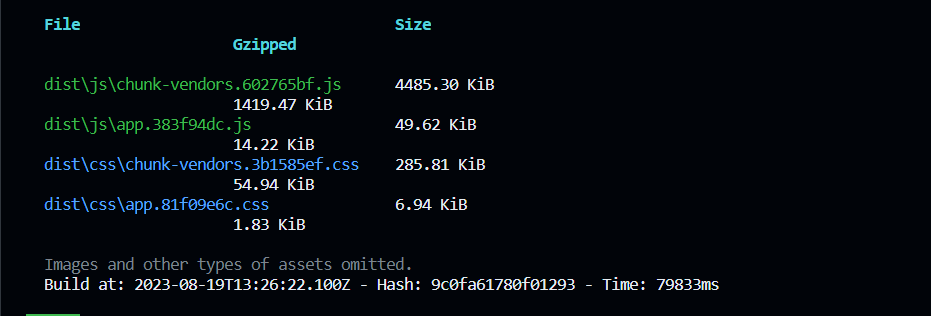

# 配置webpack

## 目标

- 目标：手动配置webpack以提高**生产环境**打包速度、减小打包体积

  - 未手动配置webpack，使用`npm run build`**打包生产环境的代码**,打包结果如下

    耗时：约80s

    chunk-vendors文件大小有4M。没有使用动态加载，因此这些组件在使用的时候会在刚访问网站的时候一起加载，弱网的情况下只能显示一个大白板。

    

  - 通过` Chrome `的` Instrument converge `功能查看` js`，`css` 的资源未使用率

    方法：打开 Chrome 的调试模式，CRTL+SHIFT+P 调出命令面板，输入 Coverage，选择 Show Coverage，，点击按钮 Instrument converge 就能查看已加载资源的未使用率。

    

    `chunk-vendors.82702712.js`未使用率约60%

    `app.js`未使用率约70%

    `app.css`未使用率约80%

    `chunk-vendors.ea3fa8e3.css`未使用率90%

- **基于上述问题，优化打包可以从以下几方面入手**

  路由组件动态引入，按需要加载。将`app.js`拆分为若干`js`使用时采取加载

  使用第三方库，按需加载，将`chunk-vendors.js`拆分，等到需要时再去加载

  压缩资源文件，减小大小

## 优化项目打包

https://juejin.cn/post/6844904029601038343

### 路由懒加载


- 开发环境下安装包

  ```sh
  npm i eslint-webpack-plugin -D 
  npm i html-webpack-plugin -D
  npm i mini-css-extract-plugin -D
  npm i css-minimizer-webpack-plugin -D
  npm i image-minimizer-webpack-plugin -D
  npm i vue-loader -D
  npm install -D webpack-cli
  ```

- 配置`webpack.prod.js`

  

- 配置`package.js`

  ```json
  
  ```
  
  
  
  

